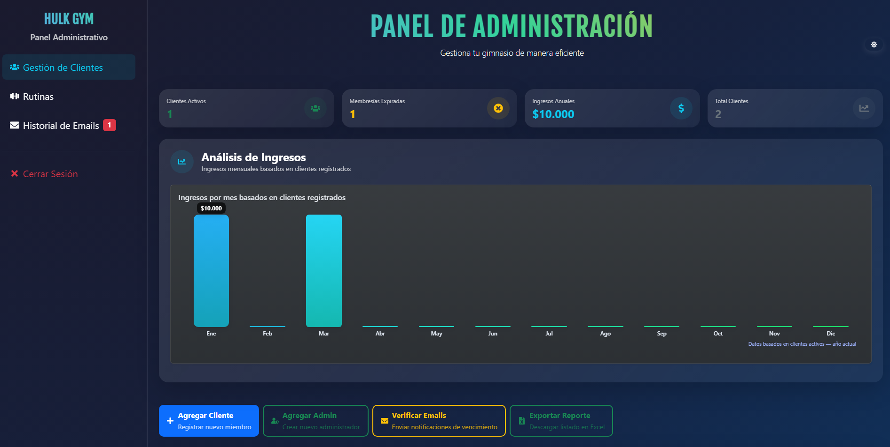
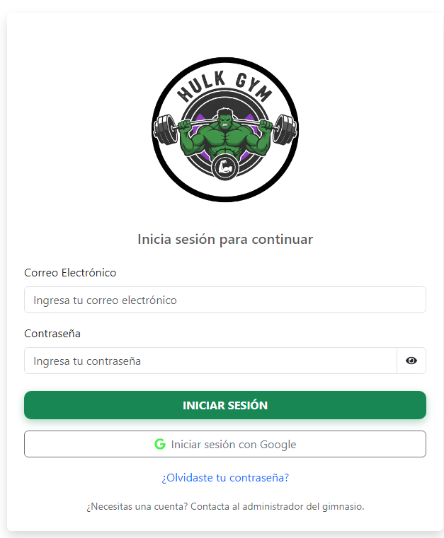
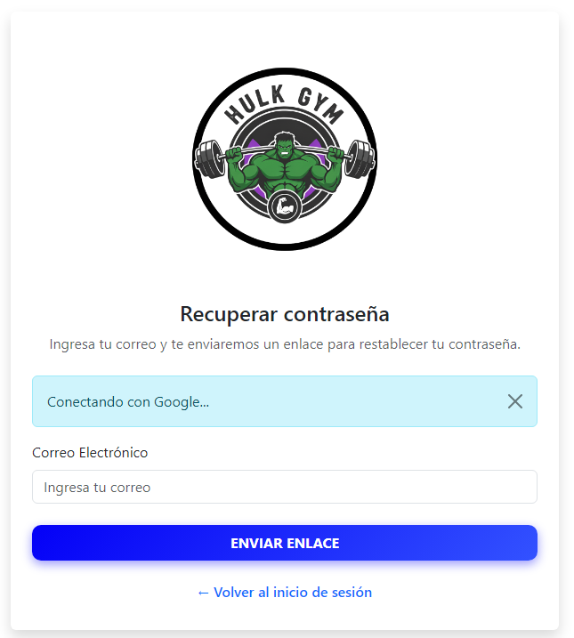
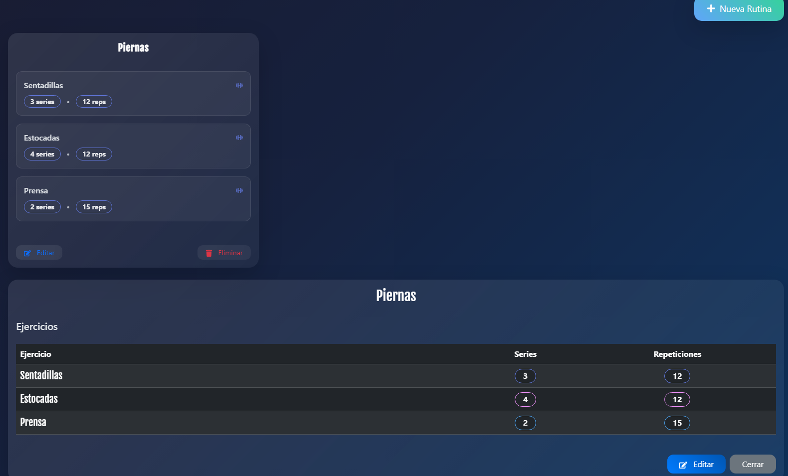
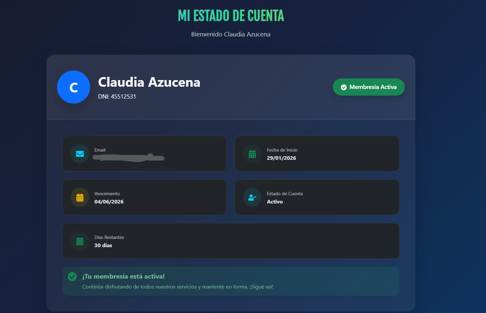

# 🏋️‍♂️ Sistema de Gestión de Gimnasio

### 💪 Plataforma web para la administración completa de un gimnasio

Gestión de clientes • Control de pagos • Rutinas • Notificaciones automáticas

---

# 📖 Descripción

Este proyecto es una aplicación web desarrollada para facilitar la administración de un gimnasio, permitiendo llevar un control organizado de los clientes, pagos mensuales, rutinas y administración general del sistema.

La plataforma cuenta con dos tipos de usuarios:

* **Administrador**
* **Cliente**

Cada uno posee funcionalidades específicas adaptadas a sus necesidades.

---

# 🚀 Funcionalidades

# 👨‍💼 Panel de Administración

El administrador tiene acceso completo al sistema y puede realizar las siguientes acciones:

## 📊 Gestión General

* Control de ingresos mensuales durante todo el año.
* Visualización de cantidad total de clientes registrados.
* Administración completa de alumnos.

## 👥 Gestión de Clientes

* Listado completo de clientes.
* Visualización de:

  * Nombre y apellido
  * Email
  * Teléfono
  * Fecha de vencimiento
  * Datos personales registrados
* Alta, baja y modificación de clientes.

## 🏋️ Gestión de Rutinas

* Creación de rutinas.
* Edición de rutinas.
* Eliminación de rutinas.

## 📧 Sistema de Correos

* Historial de mails enviados.
* Verificación automática de clientes vencidos.
* Envío de correos electrónicos recordando el pago mensual.

## ⚙️ Herramientas Administrativas

* 📥 Exportar listado de alumnos a Excel.
* ➕ Agregar nuevos clientes.
* 📨 Verificar clientes vencidos y enviar mails automáticos.
* 👑 Agregar nuevos administradores.

---

# 👤 Panel del Cliente

Cada cliente posee un espacio personal donde puede visualizar su información.

## 📄 Información Disponible

* Datos personales.
* Estado de la cuenta.
* Fecha de vencimiento.
* Dias restantes.
* Fecha de inicio.

## 🏋️ Rutinas

* Visualización de rutinas en modo solo lectura.

---

# 🔐 Autenticación

El sistema cuenta con autenticación segura para usuarios y administradores.

## ✅ Inicio de Sesión

* Ingreso mediante:

  * Credenciales (email y contraseña)
  * Cuenta de Google

## 🔑 Recuperación de Contraseña

* Opción “Olvidaste tu contraseña”.

## 📝 Registro de Usuarios

* Registro tradicional con formulario.

---

# 🛠️ Tecnologías Utilizadas

Este proyecto fue desarrollado utilizando tecnologías modernas para aplicaciones web.

## 🎨 Frontend
- React
- Vite
- HTML5
- Bootstrap
- React Bootstrap

## ⚙️ Backend y Servicios
- Express
- Firebase
- Firebase Authentication
- Firebase Firestore

## 📊 Gráficos y Estadísticas
- Chart.js
- React Chartjs 2

## 🔐 Autenticación
- Inicio de sesión con credenciales
- Inicio de sesión con Google

## 📦 Librerías y Herramientas
- React Router DOM
- React Hook Form
- Axios
- SweetAlert2
- React Icons
- Bootstrap Icons
- XLSX
- File Saver
- Dayjs
- EmailJS

---

# 📦 Funcionalidades Destacadas

✔️ Gestión completa de clientes
✔️ Control de vencimientos
✔️ Envío automático de emails
✔️ Exportación a Excel
✔️ Gestión de rutinas
✔️ Login con Google
✔️ Recuperación de contraseña
✔️ Panel administrador y cliente

---

# 🎯 Objetivo del Proyecto

Brindar una solución práctica y organizada para gimnasios, facilitando la administración diaria y mejorando el seguimiento de clientes, pagos y rutinas.

---

# 📷 Capturas

  

  

  

  

  

---
# 👨‍💻 Autor

Proyecto desarrollado por **[Franco Pereyra]**

---

### ⭐ Gracias por visitar el proyecto ⭐

